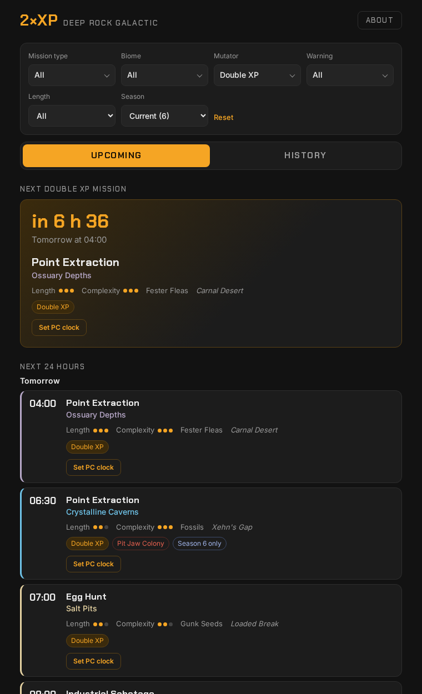
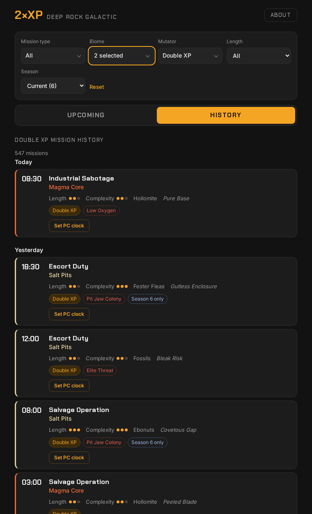

# DRG Double XP

[](LICENSE)

A small website that shows the **missions of [Deep Rock Galactic](https://www.deeprockgalactic.com/)**, **Double XP** first but also every other mutator (*Gold Rush*, *Golden Bugs*, *Low Gravity*…): what is live right now, what is coming in the next days, and a searchable archive of every mission since May 2026. An optional Windows helper adds a **"Set PC clock"** button that sets your computer's clock to a mission's start time, so you can actually play it.

| Upcoming | History |
| --- | --- |
|  |  |

> Fan site, not affiliated with Ghost Ship Games. *Deep Rock Galactic* and its content are the property of Ghost Ship Games. Mission data comes from [doublexp.net](https://doublexp.net).

---

## Table of contents

- [Features](#features)
- [The PC clock helper (Windows)](#the-pc-clock-helper-windows)
- [Privacy](#privacy)
- [Credits and license](#credits-and-license)

---

## Features

- **Upcoming**: the **next mission matching your filters** (a Double XP mission by default), with a countdown (or *Live now* and when it ends), then the **timeline of the live and upcoming missions**, 24 hours at a time: *Load one more day* extends it, up to the end of the known forecast (14 days). Long lists are shown 100 missions at a time (*Show more missions*). All times are shown in **your device's time zone**.
- **History**: every past mission archived since 2026-05-08 (over 1,200 a day, all mutators), newest first, with a *Show more* button (50 per page).
- **Filters shared by both tabs**, at the top of the page: mission type, biome, **mutator** and **warning** as **checkbox lists** (tick only the ones you want; no box ticked means all), length and season. A mission has at most one mutator but can have up to two warnings, so the two combine: for example *Double XP* missions with *Low Oxygen*, or with *No warning* at all. By default a mission matches when it has **any** of the selected warnings; tick *Must have all selected* to require **all** of them (two warnings only occur on missions without a mutator, so this option clears the mutator filter, and choosing a mutator afterwards unticks it). The mutator list defaults to **Double XP**; the season defaults to the current one, **deduced from the data**. Switching between *Upcoming* and *History* keeps the filters. They live in the address bar (`?biome=Salt+Pits%2CMagma+Core&season=s6`), so a search can be shared or bookmarked, and they are remembered by your browser for your next visit.
- **Details on every mission**: biome (colour-coded), length and complexity gauges, secondary objective, code name, mutator, mission warnings (*Elite Threat*, *Low Oxygen*…) and a *Season N only* tag for missions that only exist for some seasons.
- **Set PC clock**: a button on every mission that opens a dialog (what it does, how to install the helper, *Cancel* / *Set clock*) and, once confirmed, sets your Windows clock to that mission's start time. See [the helper](#the-pc-clock-helper-windows).
- **Two ways to host it**, from the same code: static on **GitHub Pages**, or on **your own server** with a tiny Python API and a SQLite database.
- **Boring technology on purpose**: no framework, no bundler, no runtime dependency. Plain HTML/CSS/JavaScript in the browser and the Python standard library for the tools.

## The PC clock helper (Windows)

### What it is for

The mission list in Deep Rock Galactic is derived from the **current time**, which is why a Double XP mission is only available during its 30-minute slot. If you want to play one that is not live, your computer's clock has to show that mission's time. Doing it by hand (disable automatic time, set the date, set the time, then undo it all) is tedious. The **Set PC clock** button does it in one step.

A web page cannot change your operating system's clock, so the button relies on a small helper that you install **once**.

### A script you can read, not a program

> **The helper is not an executable.** `clock-helper.ps1` is a plain **text file**: a PowerShell script of about 130 lines, with comments, that you can open in Notepad and read from top to bottom before running anything. There is no compiled code, no installer and nothing hidden.

If downloading a file makes you uneasy, you do not have to download it at all. Create it yourself:

1. On the site, open the help dialog (**Set PC clock**, or **PC clock helper** at the bottom of the page), then **Read the script here** and **Copy the script**. Or open [the script on GitHub](site/clock-helper.ps1), click **Raw**, select everything (<kbd>Ctrl</kbd>+<kbd>A</kbd>) and copy it (<kbd>Ctrl</kbd>+<kbd>C</kbd>). Read it if you like.
2. Paste it into a new **Notepad** document.
3. Save it in your **Downloads** folder as `clock-helper.txt`.
4. Rename it to `clock-helper.ps1`. If Windows hides the `.txt` part, turn on *File name extensions* in File Explorer (**View → Show** on Windows 11, **View** tab on Windows 10).

The result is exactly the same file as the one the site offers for download (the script contains only plain ASCII characters, so copying and pasting cannot alter it). Then continue with the install command below.

### How to use it

1. Click **Set PC clock** on any mission. A dialog shows the mission, the time your clock will be set to, and the install steps.
2. **First time only: install the helper.** Download [`site/clock-helper.ps1`](site/clock-helper.ps1) (the dialog links to it), or [create it yourself by copy and paste](#a-script-you-can-read-not-a-program). Then open **PowerShell** (Start menu, type "PowerShell") and run:

   ```powershell
   powershell -ExecutionPolicy Bypass -File "$env:USERPROFILE\Downloads\clock-helper.ps1"
   ```

   Adjust the path if your browser saves files elsewhere. Windows asks for administrator rights if it needs them, then the script prints `Installed. Self-test OK.`
3. Back on the site, click **Set clock**. Your browser asks **once** whether it may open the helper: allow it. Your clock is now set to the mission's time.
4. When you are done, click **Restore PC clock** (bottom of every page, and in the dialog). It resumes Windows' time synchronisation and resyncs the clock.

> **Always restore the clock.** While it is shifted, Windows Time sync is paused and other software (browsers, mail, logins, certificates) may misbehave. Restoring takes a second.

Requirements: Windows 10 or 11, PowerShell 5.1 or later (included), and the **administrator account** you are logged in with. The install is **per Windows user**, and the browser prompt is **per browser**.

### What the helper installs

Nothing else, and nothing is sent over the network. The script header lists the same things:

| What | Where | Role |
| --- | --- | --- |
| A `drgtime://` link handler | registry key `HKCU\Software\Classes\drgtime` | Opens `drgtime-link.ps1` when a `drgtime://` link is clicked |
| `drgtime-link.ps1` | `%LOCALAPPDATA%\DrgClock\` | Checks the link, writes a one-line request file, starts the scheduled task |
| Scheduled task `DrgClock-Set` | Task Scheduler | On demand only (no trigger), your account, highest privileges. Runs `set-time.ps1` |
| `set-time.ps1` | `C:\Program Files\DrgClock\` (writable by administrators only) | Reads the request, validates it again, changes the clock |

There is **no resident process**: Windows starts the scripts only when you click a button, and they exit after a second or two.

### Security model

The task needs administrator rights because changing the system clock requires them. The design keeps that surface as small as it can be:

- The script that runs **elevated** lives in `C:\Program Files\DrgClock\`, which only administrators can modify. A program running as you cannot swap it for something else.
- The only thing a normal program can influence is the **request file**, which is *data*, not code. `set-time.ps1` accepts exactly two forms and rejects everything else:
  - `set <UTC time>`, strictly `YYYY-MM-DDTHH:MM:SSZ`, between the years **2020 and 2035**: stops Windows Time and sets the clock;
  - `reset`: starts Windows Time and resyncs.
- The link handler validates the `drgtime://` address with a strict pattern before writing anything, so extra parameters or shell characters are refused.
- No network access, no download, no persistence beyond the registry key, the task and two folders.

What this does **not** prevent, so you can decide in full knowledge:

- **Any program running as your user can ask the helper to set the clock** (within 2020-2035). Without the helper, a non-elevated program cannot.
- **Any website can open a `drgtime://` link.** Browsers ask for your permission the first time for each site, and the effect is limited to the two actions above. Only allow it for sites you trust, and click **Restore PC clock** if something looks wrong.

Uninstall at any time (removes the task, the registry key and both folders, and restarts Windows Time):

```powershell
powershell -ExecutionPolicy Bypass -File "$env:USERPROFILE\Downloads\clock-helper.ps1" -Uninstall
```

Changing the clock can affect online services and other software. Use it at your own risk; this project is not endorsed by Ghost Ship Games.

### Troubleshooting

| Symptom | Cause and fix |
| --- | --- |
| Clicking **Set clock** does nothing | The helper is not installed. Run the install command above and wait for `Installed. Self-test OK.` |
| *Run with PowerShell* is missing, or the file opens in an editor | `.ps1` files are associated with another program on your PC. Use the PowerShell command from the install steps instead |
| The browser asks to open an application | That is the one-time permission for `drgtime://`. Allow it (and tick "always allow" if offered) |
| `Installed` appears but the self-test fails | The scheduled task could not run. Check Task Scheduler for `DrgClock-Set`; run the script from an **administrator** PowerShell |
| The clock goes back to the real time by itself | Windows Time sync is running again (reboot, or the service was restarted). Click **Set clock** again |
| The date is wrong after playing | Click **Restore PC clock**. If it does not help, turn on *Set time automatically* in Windows Settings → Time & language |
| Standard (non-administrator) account | Not supported: the installer would need another account's credentials and would install into the wrong profile |

## Privacy

- No cookies, no accounts, no ads.
- **Visit statistics**, only when the site owner configures them (GitHub Pages: repository variable `DRG_GOATCOUNTER`): the pages then load [GoatCounter](https://www.goatcounter.com/), an open-source statistics service that uses **no cookies** and **stores no personal data**. It counts page views (without the address's filters), where visitors come from (referring site, country), browser and screen size, and a few anonymous actions: opening the clock dialog, reading, copying or downloading the helper script, *Set clock* / *Restore PC clock*, filter changes, *Load one more day* and *Show more*. Nothing is counted when the variable is not set, nor on a self-hosted server.
- The pages load two web fonts (*Chakra Petch* and *Inter*) from Google Fonts. Remove the three `<link>` lines in `site/index.html` and `site/history.html` if you want zero third-party requests (the fonts then fall back to system fonts).
- The only thing kept in your browser is your last filters (`localStorage`, key `drg-filters`), so that they are back on your next visit. *Reset* clears them.
- The helper runs locally and never contacts the network.

## Credits and license

- Mission schedule data: [doublexp.net](https://doublexp.net). Thank you for publishing it.
- *Deep Rock Galactic* is a trademark of Ghost Ship Games. This is an unofficial fan project.
- Code released under the [MIT License](LICENSE).
